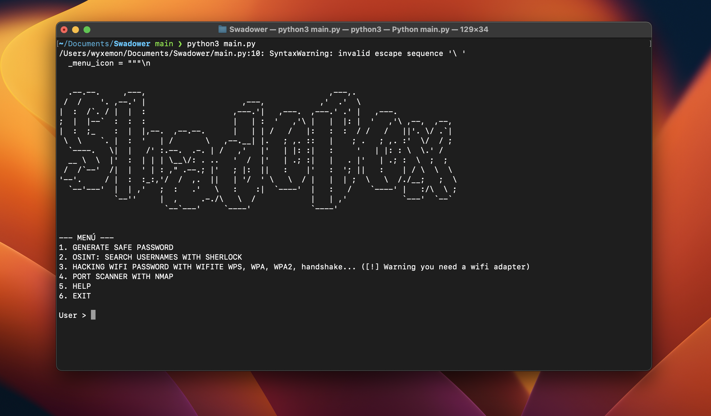

# Welcome to ShadoBox

SwadoBox is a comprehensive cybersecurity suite designed for pentesters, security researchers, and ethical hackers. Written in Python, it includes a variety of modules for security testing, OSINT, brute-force attacks, and more.



## Only for LINUX ( Recommended: Kali Linux )

## Features

- **WiFi Hacking:** Attacks on WiFi networks, security auditing, and packet capture.
- **Port Scanning:** Detect open ports on specific targets.
- **Shodan Searches:** Obtain critical information about Internet-connected devices.
- **Brute Force Attacks:** Crack passwords using dictionary-based attacks.
- **Malware Analysis and Creation:** Study malware and generate custom payloads.
- **OSINT Techniques:** Collect information from open sources.

## How to Run

Follow these steps to install and run MinePy-Launcher on your local machine:

1. Clone the repository:  
   ```bash
   git clone https://github.com/Wyxemon/ShadoBox.git
   ```

2. Navigate to the project directory:  
   ```bash
   cd ShadoBox
   ```

3. Install the dependencies:  
   ```bash
   pip install -r requirements.txt
   ```

4. Run the application:  
   ```bash
   python3 main.py
   ```

## Warning

This tool is for educational purposes and authorized security testing only. Misuse is illegal and punishable by law.

*Thank You!*
